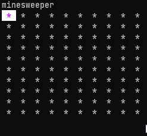

# Minesweeper

Really basic implementation of Minesweeper in the terminal.

Written in Go, using [Charm Bubble Tea](https://github.com/charmbracelet/bubbletea) and [Charm Lip Gloss](https://github.com/charmbracelet/lipgloss)

### Run:
`$ make game`

### Build:
`$ make build`

### Install:
`$ make install`
Then you can run:
`$ minesweeper`
